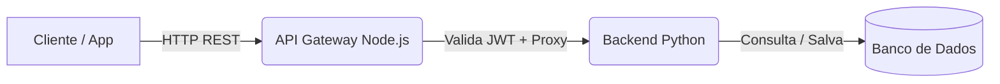

# Documento de Arquitetura: Middleware de API Gateway

## 1. Cenário de Aplicação
O sistema foi desenhado para o cenário de **Sistema de Votação Eletrônica Escalável**.
A principal necessidade deste cenário é garantir alta disponibilidade, segurança na autenticação dos eleitores e repasse rápido dos votos para os microsserviços de processamento.

## 2. Arquitetura da Solução
A arquitetura segue o modelo de camadas, utilizando o padrão **API Gateway** como ponto único de entrada para todas as requisições.

**Fluxo Básico (Cliente ao Banco de Dados):**
`Cliente (Frontend/Mobile)` ➔ `API Gateway (Node.js)` ➔ `Servidor Backend (Python/FastAPI)` ➔ `Banco de Dados (PostgreSQL)`

## 3. Componentes e Tecnologias
- **Cliente:** Faz as requisições HTTP REST.
- **Middleware (API Gateway):** Desenvolvido em Node.js (Express). É o coração da camada de segurança. Responsável por validar credenciais via hash (scrypt), emitir e validar JWT, e atuar como um roteador proxy transparente para as rotas protegidas.
- **Servidor Backend:** Desenvolvido em Python (FastAPI). Focado estritamente na regra de negócio (listar candidatos e registrar votos).
- **Banco de Dados:** Utilizado pelo backend para persistência (PostgreSQL).
- **Orquestração e CI:** Docker Compose para unir os containers em uma rede virtual. GitHub Actions para testes automatizados.

## 4. Requisitos Obrigatórios Atendidos
- **Autenticação:** Validação via JWT, bloqueando requisições sem token válido (Retornando 401 Unauthorized).
- **Logs e Timestamp:** Uso da biblioteca `Pino` para logs estruturados, gerando rastreabilidade com `x-request-id` e `timestamp`.
- **Exceções e Timeout:** O Proxy aborta requisições travadas no backend (gerando HTTP 504 Timeout) ou cai graciosamente (HTTP 502 Bad Gateway) se o Python estiver offline.
- **Documentação:** Acessível via rota `/docs` do Swagger.

## 5. Proposta de Arquitetura na Nuvem (Integração AWS)
Conforme escopo do projeto (G1), para a transição do ambiente de desenvolvimento local para um ambiente de nuvem real e massivamente escalável, a solução adotaria o **Amazon API Gateway**.

**Benefícios da Arquitetura AWS:**
1. **Redução de Carga Operacional:** O Amazon API Gateway é um serviço gerenciado, substituindo o servidor Node.js local.
2. **Segurança Avançada:** Pode ser integrado facilmente ao AWS WAF (Web Application Firewall) para bloquear robôs e ataques de negação de serviço (DDoS).
3. **Autorização Nativa:** A validação do token JWT pode ser feita utilizando os *Lambda Authorizers* ou nativamente com o *Amazon Cognito*.
4. **Monitoramento:** Métricas de latência e erros HTTP 5xx são rastreadas automaticamente no AWS CloudWatch, sem necessidade de programar logs complexos.
